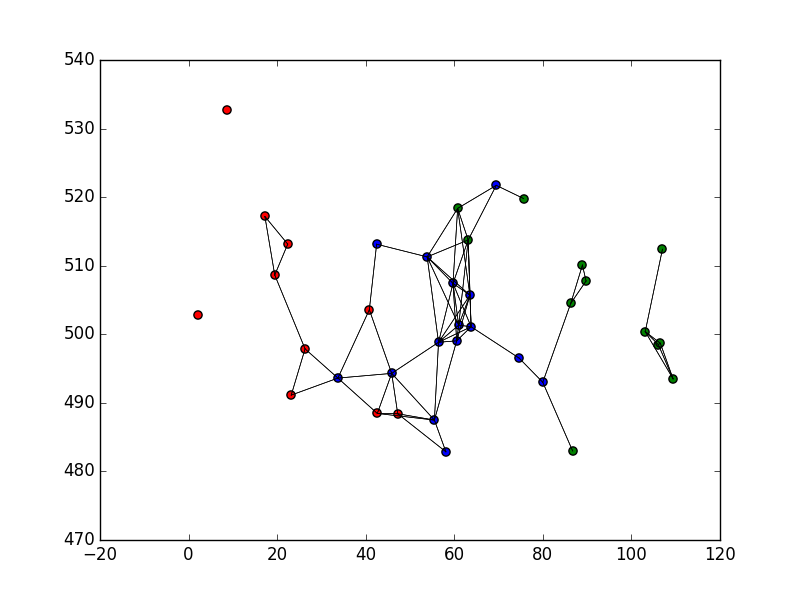
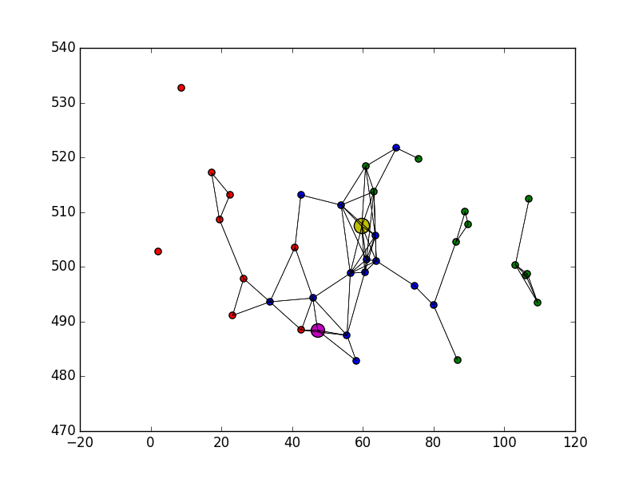
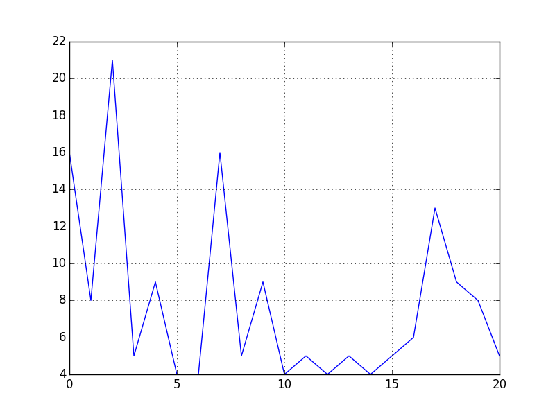

# Agents

Agent based modeling from the ground up

How might different machine learning strategies lead to different agent behaviors?

## Initial Sketch

In the initial sketch:

* A world of agents is randomly created, with connections defined by physical proximity 
* Task messages are handed down to a particular agent, who aims to pass it to its delivery address
* Agents choose randomly from among their connections to send the package on its way
* When a successful delivery occurs, particpants are `award`ed some `value` that is a function of the number of steps in the delivery chain and their proximity to the end of the chain
* When an agent receives an award, it might increase the likelihood of sending a message to the neighbor it sent the message to during that successful run. The higher the value awarded, the more likely they are to make this permanent change to their connection-sending preferences

## Initial Results

The sketch supports plotting of the entity graph and of the passing of the message.

We asked the agents to deliver the magenta point to the yellow point, 25 times:

And here were the number of traversals made during successful runs over course of those iterations:

As you can see, the agents were able to deliver the message faster as they went along!
